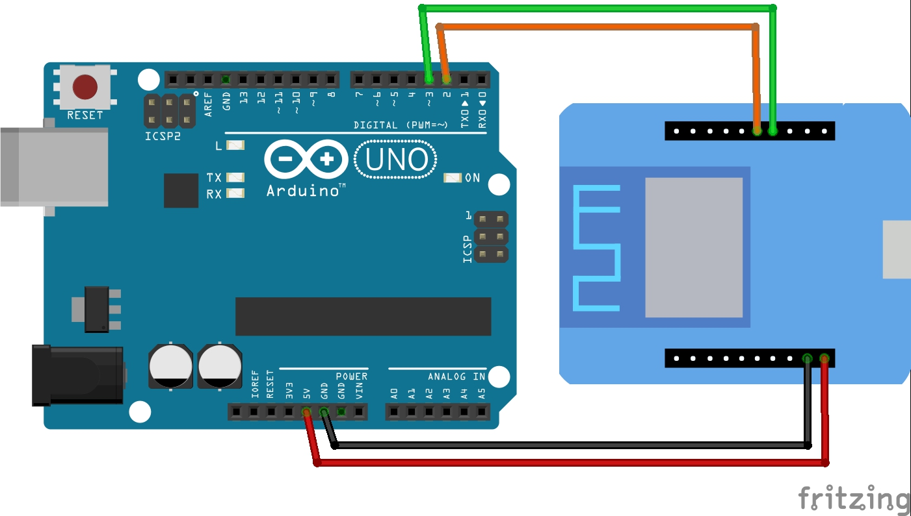

# ArduinoESPAT
A library to control esp-8266 from Arduino by AT commands easier.

# Wiring Diagram


| Arduino Uno | ESPr |  
:---:|:----:  
| 5V | Vin |  
| GND | GND |  
| D2 | TX |  
| D3 | RX |   
# Usage
## Definition
You need SSID and password for your Access Point.
```c
ESPAT espat(<ssid>, <password>);
```

## begin(): bool
Caution!!: You should call this method before other methods on this library.    
```c
ESPAT espat(<ssid>, <password>);  

void setup(){
  espat.begin();
}
```
## checkAT(): bool
This method tell you AT command is Available or Not.

```c
espat.checkAT();
```

## changeMode(uint8_t mode): bool
This method send AT command(AT+CWMODE).  

Arguments:  
* mode => Wifi mode. (0: station, 1: softAP, 2: station + softAP)

```c
espat.changeMode(1); // Wifi is station mode.
```

## tryConnectAP(): bool
This method connect with AP.  

Caution!!: You should set correct ssid and passwd at Definition.  
```c
espat.changeMode(1) // set station mode
espat.tryConnectAP();
```

## clientIP(): String
This method tell you client IP address.

Returns:  
* "192.168.xx.xx" => Correct IP address.
* "" => If failed to get IP address, you get empty.    


You can check IP address by:
```c
if(espat.clientIP() != ""){
  // do something
}else{
  // do something for error
}
```

## get(String host, String path, optional int port): String
This method send GET request and return Body of Response by String.

Caution!!: You should call tryConnectAP before this method.  
Caution!!: You also hove to check client IP address is valid by call clientIP().  
Caution!!: Limit of return(String) is 1024 chars in default.  
Caution!!: Return is NOT include header of response.  

**Arguments**
* optional int port: Default is 80.

```c
Serial.println(espat.get("www.google.co.jp", "/", 80)); // You can display response to serial monitor.(by 1024 chars);
```

## advGet(String host, String path, optional int port, optional void (\*callback)(char)): bool
This method send GET request and you can get response by char in callback. 

Caution!!: You should call tryConnectAP before this method.  
Caution!!: You also hove to check client IP address is valid by call clientIP().  

**Arguments**

* optional int port: Default is 80.
* optional void (\*callback)(char): Argument of callback is response by character.

```c
espat.advGet("www.google.co.jp", "/", 80); // response is displayed by serial monitor.
void callback(char c){
  Serial.print(c);
}
espat.get("www.google.co.jp", "/", 80, callback) // same with previous call.
```
